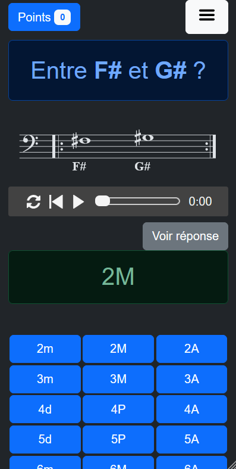
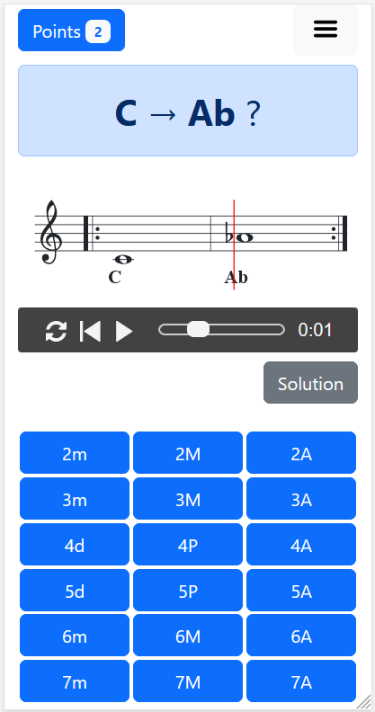
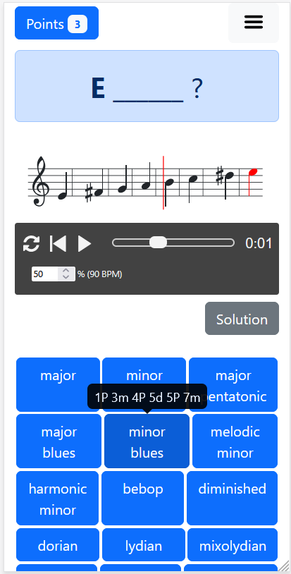
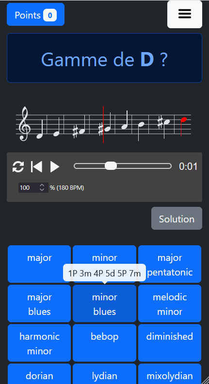
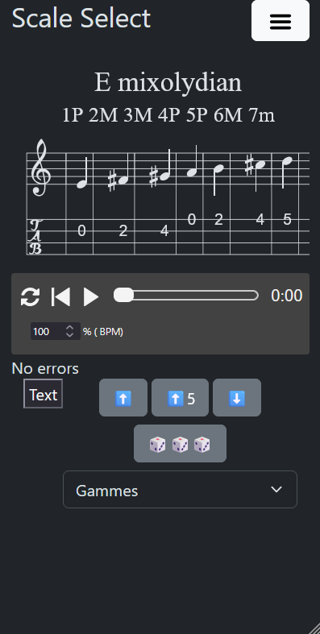
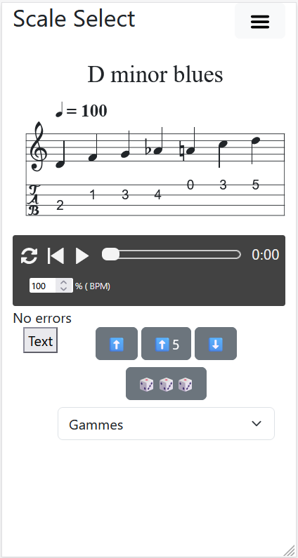
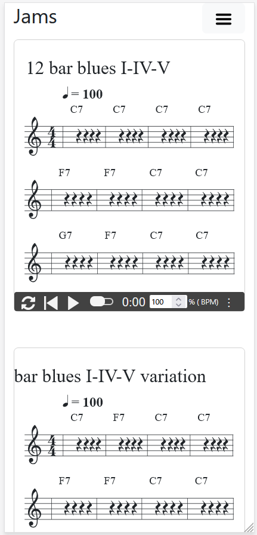
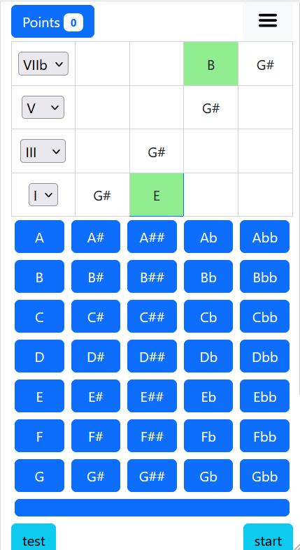
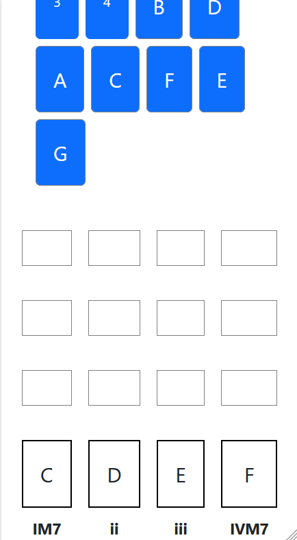
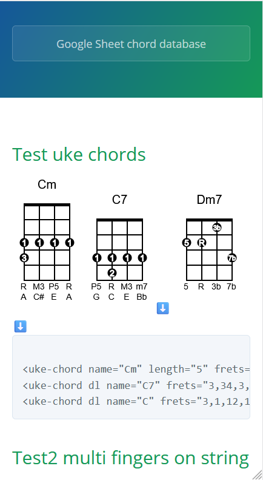

# Android Music Theory Games
Android application for practicing music theory, scales, chords, intervals, 100% offline, including music Midi sounds.

# Features
* [x] dark / light mode
* [x] music sound (mainly piano, but also violin and guitar)
* [x] quizzes (intervals in treble and bass key, scales names, chords)
* [x] sound loops for improvisation
* [x] customizable partitions (simple training exercises, in ABC notation)
* [ ] internationalization (almost no text: I18n in progress English, French for now)
* [ ] saving custom exercises created by user

# Status
* Experimental
* Requires minimal Android 7
* Download: https://github.com/fxpar/android_music_theory_games/releases/tag/v0.2.0-alpha

# Screenshots

### Intervals training
 

### Scale Coach identification
* Easy change of bpm
* Easy transposition up / Down / Fifth
* Includes 100 scales examples
* Easy sound listening
* Easy tempo change
* Random more for discovery

  

#### tablatures
* [x] Currently for ukulele g-tuning reentrant (GCEA)
* [ ] Future version with guitar

 

### Jam session

Work your improvisation with some custimizable jazz grids loops.
* Best sound for bass and chord is piano
* Customizable sound (guitar nylon and violin, but midi sound that great)
* Customizable Chords font size
* you can test them: https://www.fxparlant.net/accompagnement-jam/

### Drag and drop chord Games
* [ ] Work in progress: experimental games for learning chords construction

 

### Ukulele / Guitar chords chart creator
🚧In testing.
Javascript customized version to include:
* in bubble two characters
* two rows of indications below
* download svg button

# Specs
* Using ABCJS from Paul Rosen
* Using TonalJS
* UkeChords

