# Android Music Theory Games
Android application for practicing music theory, scales, chords, intervals, 100% offline, including music Midi sounds.

# Features
* [x] dark / light mode
* [x] music sound (mainly piano, but also violin and guitar)
* [x] quizzes (intervals in treble and bass key, scales names, chords)
* [x] sound loops for improvisation
* [x] customizable partitions (simple training exercises, in ABC notation)
* [ ] internationalization (almost no text: I18n in progress English, French for now)
* [ ] saving custom exercises created by user

# Status
* Experimental
* Requires minimal Android 7
* Download: https://github.com/fxpar/android_music_theory_games/releases/tag/v0.2.0-alpha

# Screenshots

### Home Screen
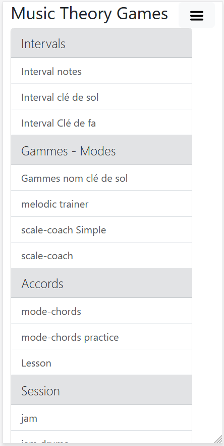 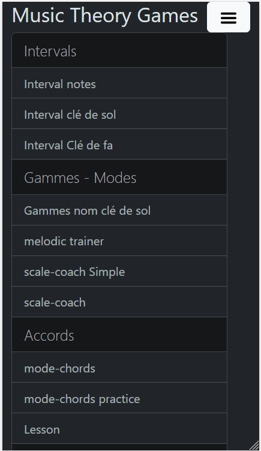 

### Metronome
*[x] various tempos
*[x] customizable in each abc editor
*[ ] tempo trainer

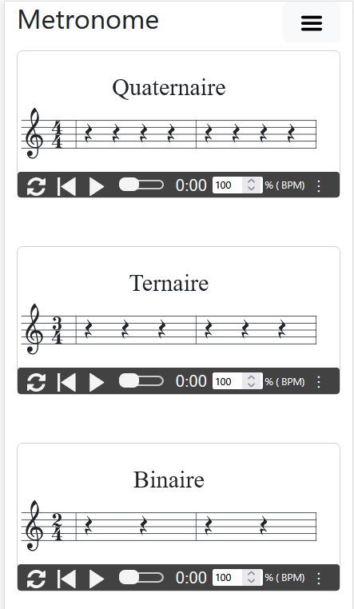 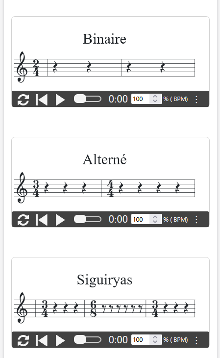

### Intervals training
 

### Scale Coach identification
* Easy change of bpm
* Easy transposition up / Down / Fifth
* Includes 100 scales examples
* Easy sound listening
* Easy tempo change
* Random more for discovery

  

### Scale Chords progression
* Notes of the scales
* Chords
* Transposition

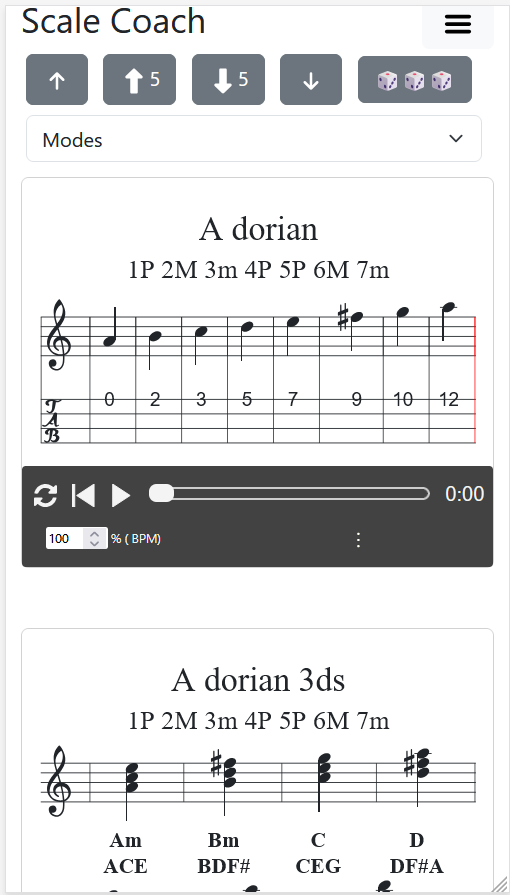 

### Melodic Trainer
Creates pages of exercises from a scale:

* Choose a scale
* Choose an number a notes exercises (3 notes, 4 notes, custom)
* Version with / without tablature
* Tablatures available: guitar, ukulele, violin, none
* Tempo adjustment
* Transposition
* Presets of rhythms

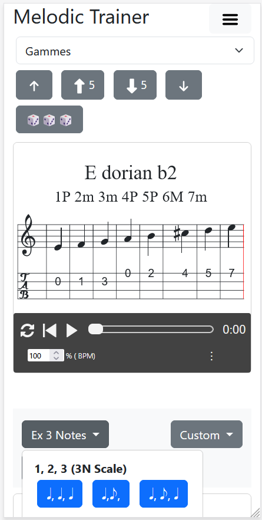 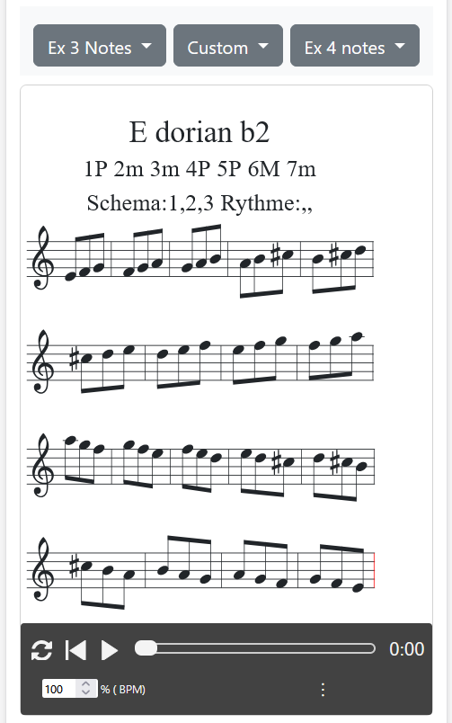 

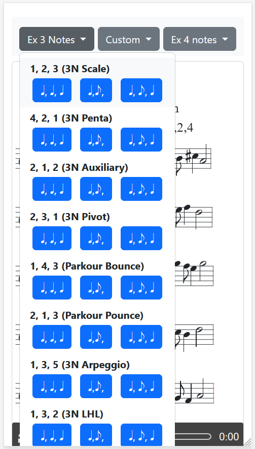 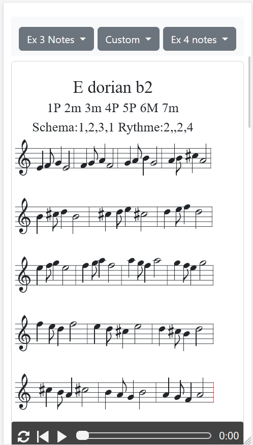 

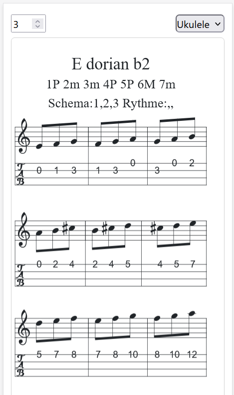 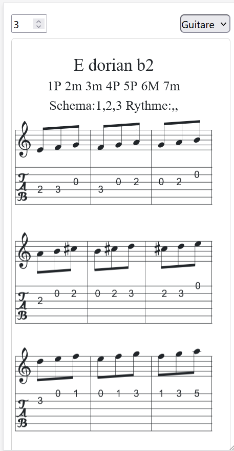 

#### tablatures
* [x] Currently for ukulele g-tuning reentrant (GCEA)
* [x] Future version with guitar, violin

 

### Jam session

Work your improvisation with some custimizable jazz grids loops.
* Best sound for bass and chord is piano
* Customizable sound (guitar nylon and violin, but midi sound that great)
* Customizable Chords font size
* Customizable gchord string playback
* you can test them: https://www.fxparlant.net/accompagnement-jam/

 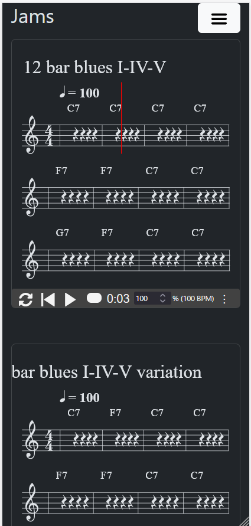

### Drag and drop chord Games
* [ ] Work in progress: experimental games for learning chords construction

 

### The ⋮ "more" button
Provides additionals controls to the player:
* Transposition +12 / -12 half tones
* Play the chords (chordson) / don't play them (chordsoff)
* Increase / Decrease swing (from 50 to 75)

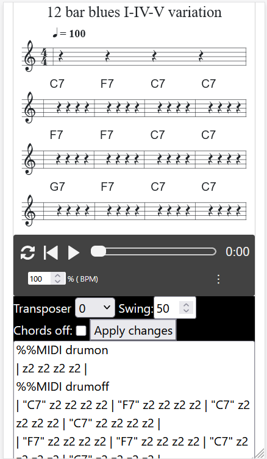

### Theory lesson reminder
* [x] mode of major scales
* [ ] modes of minor scales
* [ ] tempo reminder
* [ ] chords construction refresher

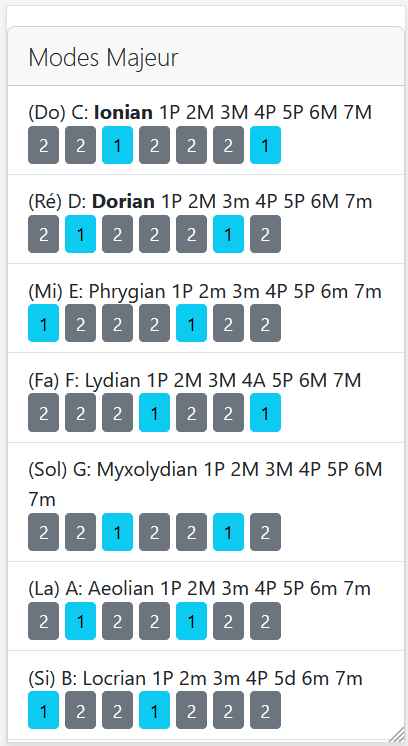

### ABCJS / MIDI Examples
* [x] change playback instrument
* [x] add intro drums
* [x] drums example

### Ukulele / Guitar chords chart creator
🚧In testing.
Javascript customized version to include:
* in bubble two characters
* two rows of indications below
* download svg button

# Specs
* Using ABCJS from Paul Rosen and Gregory Dyke (extract from MIT Licence) https://github.com/paulrosen/abcjs
* Using TonalJS by Tonal (MIT licence) https://github.com/tonaljs/tonal
* Using UkeChords by pianosnake (MIT Licence) https://github.com/pianosnake/uke-chord
* Using Bootstrap 5.3 (MIT Licence) https://github.com/twbs/bootstrap
* Using Popper.js, now Floating.ui (MIT licence) https://github.com/floating-ui/floating-ui

