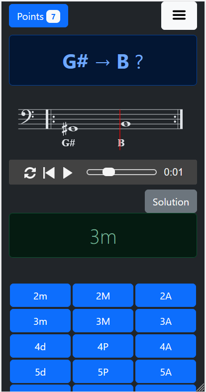

# android_music_theory_games
Android application for practicing music theory, scales, chords, interval, 100% offline, with music sounds.

# Features
* [x] dark / light mode
* [x] music sound (mainly piano, but also violin and guitar)
* [x] quizzes (intervals in treble and bass key, scales names, chords)
* [x] sound loops for improvisation
* [x] customizable partitions

# Status
* Experimental
* Requires minimal Android 7

# Screenshots

### Intervals training
 

### Scale identification
* Easy change of bpm
* Easy transposition up / Down / Fifth

  

### Jam session

Work your improvisation with some custimizable jazz grids.
* Customizable Chords font size

